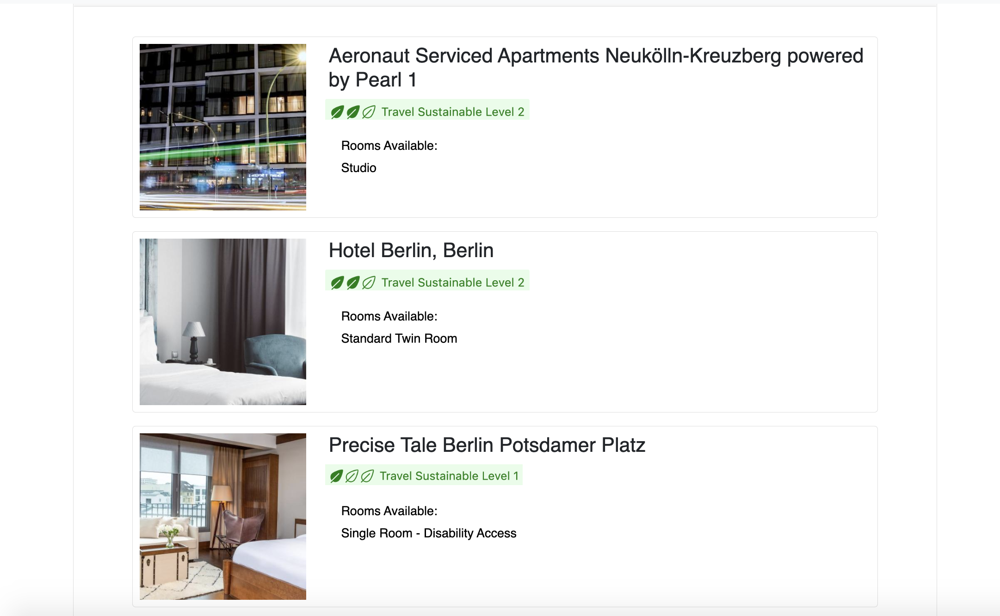
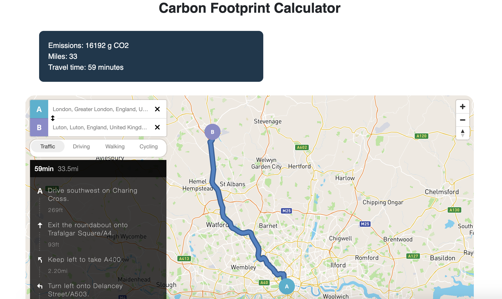
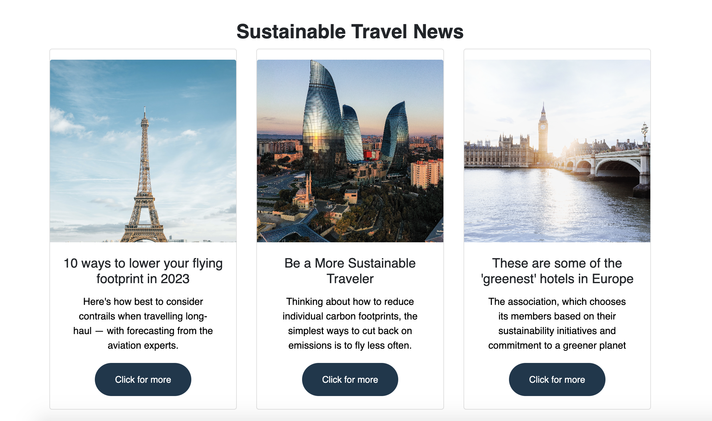
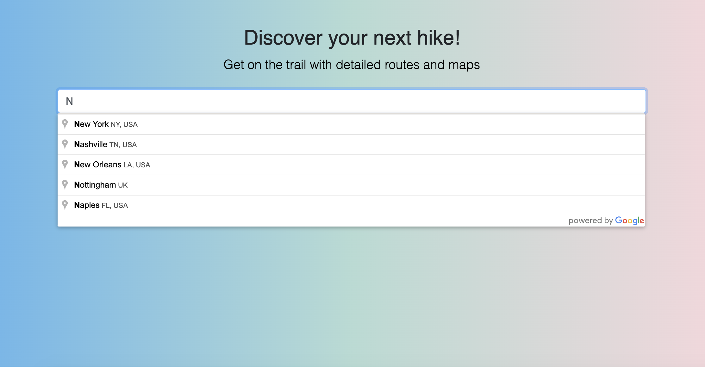
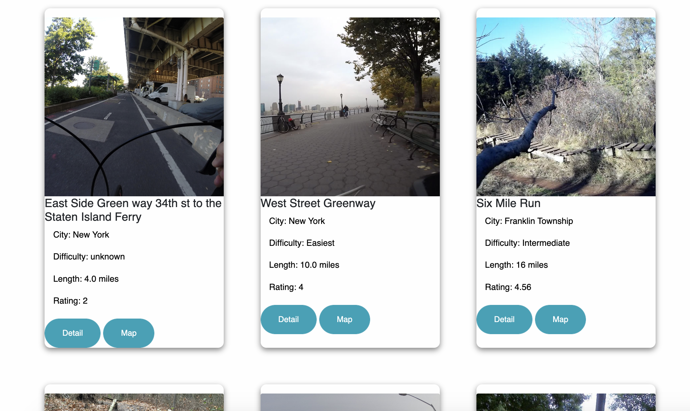

# Eco-Travel-Planner
Application that helps travelers find sustainable travel options, calculates the estimated carbon emissions generated from their travel itinerary and shows sustainable travel options such as hike and bike trails.

## Links

Deployed at: https://omar-ahm.github.io/Eco-Travel-Planner/

## Description 

We created an application to help travelers who are environmentally conscious and want to minimize their carbon footprint. The app helps travelers find and book eco-friendly accommodations and provides information about sustainable travel options such as hike and bike trails in searched cities.
With the Carbon Footprint Calculator, users can calculate the estimated carbon emissions generated from their travel itinerary and make informed decisions. The app utilizes Bootstrap, DOM, javaScript, Jquery, CSS, and HTML to deliver a user-friendly and visually appealing experience. Below APIs are used in this app:

- Google Maps API
- mapBox API
- Booking.com API
- trailAPI

## Table of Contents (Optional)

* [Installation]
* [Usage]
* [License]

## Installation

1. Go To https://github.com/omar-ahm/Eco-Travel-Planner/
2. Copy the Git clone link using SSH.
3. In terminal on your local device, clone the repository using Git clone.
4. Open in Visual Studio.

## Usage 

To get started with the Eco Travel Planner, simply follow these steps:

- Open the web-page in your web browser.
- Enter the city and dates you wish to travel to in the search bar.
- Browse through the available eco-friendly accommodations and activities.
- Use the Carbon Footprint Calculator to estimate the carbon emissions generated from your travel itinerary.
- Start exploring sustainable travel options from Trail Search.
- Screeshot of the Web Page:

## Contributors

Omar Malik - https://github.com/omalik92  
Sevda Seyidova - https://github.com/Helloseva  
Omar Ahmad - https://github.com/omar-ahm

## License

Please refer to the LICENSE in the repo.